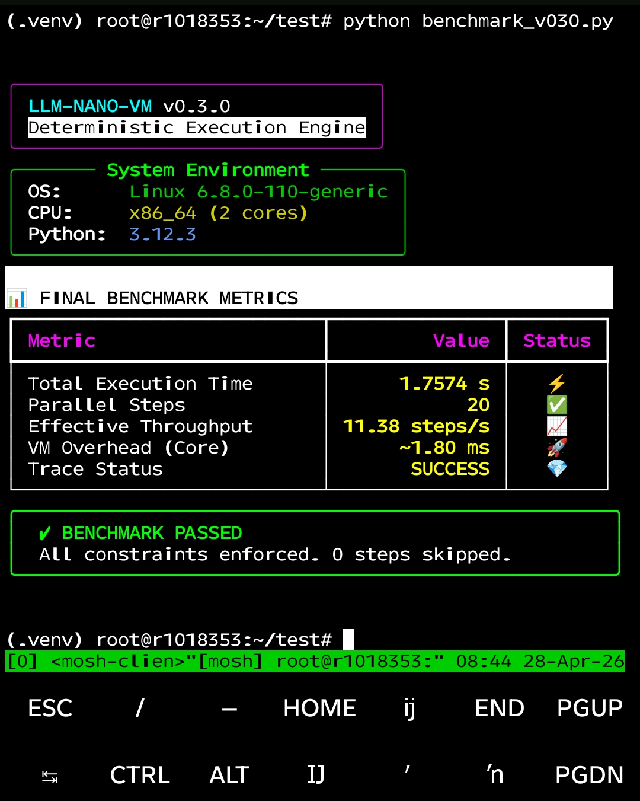
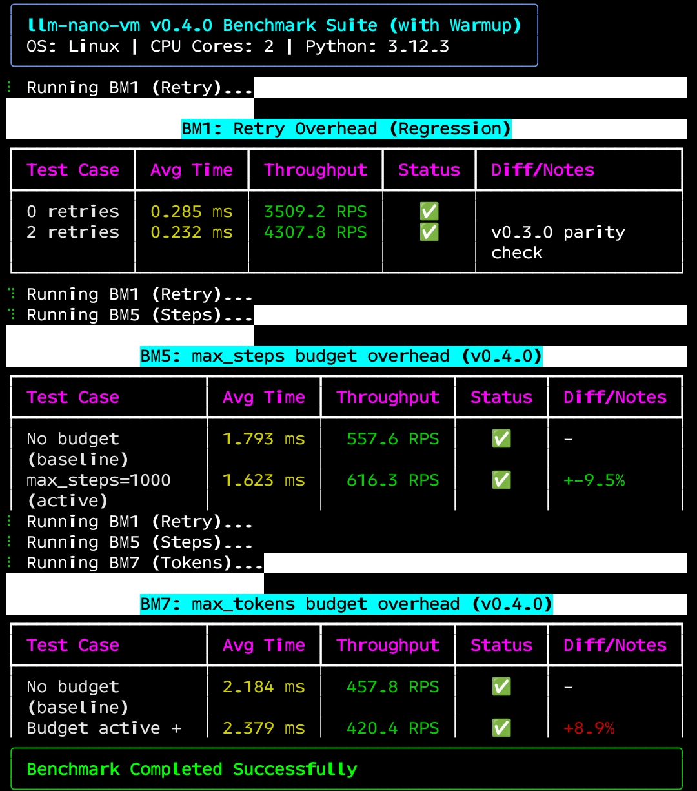

<p align="center">
  <a href="https://github.com/Ale007XD/nano_vm/actions">
    
  </a>
  <a href="https://pypi.org/project/llm-nano-vm/">
    
  </a>
  
  
</p>

<p align="center">
  <strong>Deterministic parallel execution for LLM pipelines.</strong><br>
  Use when your workflow structure is known and correctness is non-negotiable.<br>
  Guardrails enforced by the VM, not by the prompt.
</p>

<p align="center">
  <em>LangChain = flexible but unpredictable &nbsp;·&nbsp; llm-nano-vm = predictable but still flexible</em>
</p>

---

## The Problem with LLM Agents

| | Prompting | LLM Agents | **llm-nano-vm** |
| :--- | :---: | :---: | :---: |
| Execution guarantee | ❌ none | ❌ at model's discretion | ✅ enforced by VM |
| Step skipping possible | ✅ yes | ✅ yes | ❌ never |
| Reproducible trace | ❌ | ❌ | ✅ |
| Debuggable | ❌ | hard | full trace |
| Cost/latency visibility | ❌ | partial | per-step |

> "LangChain cannot guarantee execution order. llm-nano-vm can."

---

## Mental Model

```
nondeterminism ∈ Planner (1 LLM call, optional)
determinism    ∈ ExecutionVM (FSM)
```

- **Planner** — LLM converts user intent → Program DSL
- **Program** — declarative workflow you define and version
- **ExecutionVM** — finite state machine; runs the program step by step
- **Trace** — full execution log: status, cost, tokens, duration per step

The LLM is a stateless worker. Control stays in your code.

---

## Install

```bash
pip install llm-nano-vm
pip install llm-nano-vm[litellm]   # for built-in provider support
```

---

## Quick Start — Guardrail That Never Skips

```python
from nano_vm import ExecutionVM, Program
from nano_vm.adapters import LiteLLMAdapter

program = Program.from_dict({
    "name": "customer_refund",
    "steps": [
        {
            "id": "analyze",
            "type": "llm",
            "prompt": "Is this a valid refund request? Reply 'yes' or 'no'.\nRequest: $user_input",
            "output_key": "decision",
        },
        {
            "id": "guardrail",           # ALWAYS runs — VM enforces it
            "type": "condition",
            "condition": "'yes' in '$decision'.lower()",
            "then": "process_refund",
            "otherwise": "reject",
        },
        {
            "id": "process_refund",
            "type": "tool",
            "tool": "issue_refund",
        },
        {
            "id": "reject",
            "type": "tool",
            "tool": "send_rejection",
        },
    ],
})

vm = ExecutionVM(
    llm=LiteLLMAdapter("openai/gpt-4o-mini"),
    tools={"issue_refund": ..., "send_rejection": ...},
)
trace = await vm.run(program, context={"user_input": "I was charged twice"})

print(trace.status)           # SUCCESS
print(trace.final_output)     # tool result
print(trace.total_cost_usd()) # e.g. 0.000034
```

The `guardrail` step cannot be skipped, reordered, or overridden by the model.
That is the guarantee.

---

## How the DSL Controls Agent Behavior

The separation of concerns is explicit:

```
LLM decides:  WHAT to say, how to reason, what content to produce
DSL decides:  WHICH step runs next, WHEN to branch, WHEN to stop
```

The LLM has **no knowledge** of the program structure.
It receives a prompt and returns a string — nothing more.
It cannot skip steps, reorder them, or decide the workflow is complete.

### What the LLM can and cannot do

| | LLM | DSL (VM) |
| :--- | :--- | :--- |
| Produce content | ✅ free | — |
| Reason, hallucinate, be verbose | ✅ free | — |
| Skip a step | ❌ impossible | enforces every step |
| Reorder steps | ❌ impossible | order fixed at definition |
| Branch on output | ❌ cannot | `condition` step evaluates |
| Decide workflow is done | ❌ impossible | VM controls termination |

### Example — the LLM cannot jump ahead

```python
program = Program.from_dict({
    "name": "refund_with_verification",
    "steps": [
        {
            "id": "classify",
            "type": "llm",
            "prompt": "Classify: $user_input. Reply: refund / info / escalate",
            "output_key": "category",
        },
        {
            "id": "route",
            "type": "condition",
            "condition": "'refund' in '$category'",
            "then": "verify_eligibility",
            "otherwise": "handle_other",
        },
        {
            "id": "verify_eligibility",  # LLM cannot skip this — VM enforces it
            "type": "llm",
            "prompt": "Is user eligible for refund? Order: $order_id. Reply yes/no",
            "output_key": "eligible",
        },
        {
            "id": "final_guard",         # runs on EVERY execution before money moves
            "type": "condition",
            "condition": "'yes' in '$eligible'",
            "then": "issue_refund",
            "otherwise": "reject",
        },
        {"id": "issue_refund", "type": "tool", "tool": "process_payment"},
        {"id": "reject",       "type": "tool", "tool": "send_rejection"},
        {"id": "handle_other", "type": "tool", "tool": "send_info"},
    ],
})
```

Even if `classify` returns "definitely a refund, just process it" —
the VM still executes `verify_eligibility` and `final_guard`.
The LLM's *opinion* about the flow is irrelevant. The DSL is law.

### Proof: the trace

```python
trace = await vm.run(program, context={"user_input": "I was charged twice", "order_id": "123"})

for step in trace.steps:
    print(f"{step.step_id:20} {step.status}  →  {step.output}")

# classify              SUCCESS  →  refund
# route                 SUCCESS  →  verify_eligibility
# verify_eligibility    SUCCESS  →  yes
# final_guard           SUCCESS  →  issue_refund
# issue_refund          SUCCESS  →  Refund issued: $42.00
```

Every step is logged. No agent "decided" the flow. The DSL did.

---

## End-to-End Flow

```
user_input
  → Planner (optional, 1 LLM call)
  → Program (DSL — JSON/dict/YAML)
  → ExecutionVM (deterministic FSM)
  → Trace (status · cost · tokens · duration)
```

---

## Program DSL

Four step types:

| Type | Purpose |
| :--- | :--- |
| `llm` | call the model; result stored in `output_key` |
| `tool` | call a Python function |
| `condition` | branch on an expression; `then` / `otherwise` |
| `parallel` | run independent sub-steps concurrently via `asyncio.gather` |

**Step options (v0.4.0):**

| Option | Default | Description |
| :--- | :--- | :--- |
| `on_error` | `fail` | `fail` · `skip` · `retry` |
| `max_retries` | `3` | total attempts (1 initial + N retries); exponential backoff: 1s, 2s, 4s… cap 30s |
| `max_concurrency` | `None` | parallel blocks only; `None` = no cap (all sub-steps at once) |

**Program budget options (v0.4.0):**

| Option | Default | Description |
| :--- | :--- | :--- |
| `max_steps` | `None` | max total steps executed; `BUDGET_EXCEEDED` if exceeded before next step |
| `max_stalled_steps` | `None` | max consecutive no-op steps (same state fingerprint); `STALLED` if exceeded |
| `max_tokens` | `None` | max total tokens across all LLM steps; `BUDGET_EXCEEDED` if exceeded before next step |

### Variable interpolation

| Syntax | Resolves to |
| :--- | :--- |
| `$key` | value from initial context |
| `$step_id.output` | output of a previous step |

### Example — multi-step pipeline

```json
{
  "name": "doc_pipeline",
  "steps": [
    { "id": "extract",   "type": "tool", "tool": "extract_text",   "output_key": "raw_text" },
    { "id": "summarize", "type": "llm",  "prompt": "Summarize: $raw_text", "output_key": "summary" },
    { "id": "check",     "type": "condition",
      "condition": "len('$summary') > 100",
      "then": "store", "otherwise": "flag" },
    { "id": "store",     "type": "tool", "tool": "save_to_db" },
    { "id": "flag",      "type": "tool", "tool": "flag_for_review" }
  ]
}
```

### Example — parallel steps (v0.2.0+)

```python
program = Program.from_dict({
    "name": "enrich",
    "steps": [
        {
            "id": "fetch",
            "type": "parallel",
            "output_key": "fetched",
            "max_concurrency": 5,        # cap concurrent sub-steps; default = None (no cap = all at once)
            "on_error": "skip",          # failed sub-step → output is None; others still complete
            "parallel_steps": [
                {"id": "weather", "type": "tool", "tool": "get_weather", "args": {"city": "$city"}},
                {"id": "news",    "type": "tool", "tool": "get_news",    "args": {"topic": "$topic"}},
            ],
        },
        {
            "id": "summarize",
            "type": "llm",
            # $weather.output is None if weather sub-step was skipped — handle in prompt
            "prompt": "Weather: $weather.output\nNews: $news.output\nSummarize. If a field is None, skip it.",
        },
    ],
})
```

`fetch` runs both tools concurrently via `asyncio.gather`. Wall-clock time = slowest single sub-step.
Sequential execution resumes at `summarize` only after all sub-steps complete (or are skipped).

**Partial result contract:** if a sub-step fails with `on_error: skip`, its output is set to `None` in the execution context. Downstream steps receive `None` — not an absent key, not an exception. Design your prompts accordingly.

---

## Testing — Deterministic by Design

`MockLLMAdapter` ships with the package for writing tests without a real LLM:

```python
from nano_vm import ExecutionVM, Program, TraceStatus
from nano_vm.adapters import MockLLMAdapter

# Always returns the same string
vm = ExecutionVM(llm=MockLLMAdapter("SAFE"))

# Per-call sequence
vm = ExecutionVM(llm=MockLLMAdapter(["SAFE", "yes"]))

# Per-prompt mapping (substring match on last user message)
vm = ExecutionVM(llm=MockLLMAdapter({
    "Classify": "SAFE",
    "eligible": "yes",
    "__default__": "ok",
}))

trace = await vm.run(program, context={"user_input": "refund"})
assert trace.status == TraceStatus.SUCCESS
assert [s.step_id for s in trace.steps] == ["classify", "route", "verify_eligibility", ...]
```

Same input → same step sequence. Always. Testable in CI without any API key.

### State Determinism vs Semantic Determinism

llm-nano-vm guarantees **State Determinism**: given a Program, the VM executes
steps in the order the DSL defines, never skips a required step, and produces
a complete, reproducible trace — regardless of what the LLM returns.

It does **not** guarantee **Semantic Determinism**: the text content produced by
an LLM step may differ across runs even at `temperature=0.0`. Different providers,
model versions, and infrastructure states can yield different outputs for identical
prompts. This is a property of the LLM, not the VM.

| | State Determinism | Semantic Determinism |
| :--- | :---: | :---: |
| Step execution order | ✅ VM enforces | — |
| Step cannot be skipped | ✅ VM enforces | — |
| Invariants hold (no double-execution) | ✅ VM enforces | — |
| LLM output identical across runs | — | ❌ not guaranteed |
| Reproducible trace structure | ✅ always | — |
| Reproducible trace content | — | ❌ depends on LLM |

Use `MockLLMAdapter` when you need both — it gives full Semantic Determinism
in tests and CI by removing the LLM variable entirely.

---

## Observability

```python
trace.status                # TraceStatus.SUCCESS | FAILED | BUDGET_EXCEEDED | STALLED
trace.final_output          # last step output
trace.total_tokens()        # sum across all steps
trace.total_cost_usd()      # sum across all steps (requires LiteLLMAdapter)
trace.state_snapshots       # list[(step_index, sha256_hex)] — one entry per executed step
trace.error                 # set on FAILED / BUDGET_EXCEEDED / STALLED

for step in trace.steps:
    print(step.step_id, step.status, step.duration_ms, step.usage)
```

Parallel blocks expose sub-step hierarchy in the trace:

```python
# fetch              SUCCESS   142ms  usage=None
#   ├─ weather       SUCCESS    98ms  usage=None
#   └─ news          SKIPPED   429ms  usage=None   ← rate-limited, skipped
# summarize          SUCCESS  1204ms  usage=TokenUsage(prompt=312, completion=87)
```

Each sub-step has its own `status`, `duration_ms`, and `output`. If `on_error: skip` was triggered, `status=SKIPPED` and `output=None`.

---

## Planner (Optional)

```python
from nano_vm import Planner

planner = Planner(llm=adapter, max_retries=2, temperature=0.0)
program = await planner.generate(
    "Fetch latest AI news, summarize, classify by topic",
    available_tools=["fetch_rss", "summarize", "classify"],  # optional hint
    context_keys=["user_id"],                                 # optional hint
)
trace = await vm.run(program)
```

- exactly **1** LLM call
- outputs a validated `Program` object
- non-deterministic input → deterministic execution
- signature stable since v0.5.0; all parameters keyword-optional

---

## Custom Adapter

Any object implementing the async Protocol works:

```python
class MyAdapter:
    async def complete(self, messages: list[dict], **kwargs) -> str:
        ...  # call any LLM API
```

Built-in adapters via `[litellm]` extra:

```python
LiteLLMAdapter("groq/llama-3.3-70b-versatile")
LiteLLMAdapter("openrouter/llama-3.3-70b-instruct:free")
LiteLLMAdapter("ollama/llama3")
LiteLLMAdapter("openai/gpt-4o-mini")
```

---

## Performance

The VM itself introduces near-zero overhead. Your bottleneck is the LLM API.

Benchmarked on Linux, 2-core VPS, Python 3.12.3. Mock adapter (no I/O).

| Metric | Scenario | Throughput | Latency | Overhead |
| :--- | :--- | :--- | :--- | :--- |
| BM1: retry baseline | 0 retries | 3509 RPS | 0.285 ms | — |
| BM1: retry path | 2 retries | 4308 RPS | 0.232 ms | v0.3.0 parity ✅ |
| BM5: max_steps | no budget (baseline) | 558 RPS | 1.793 ms | — |
| BM5: max_steps | max_steps=1000 active | 616 RPS | 1.623 ms | **±9.5% (noise)** |
| BM7: max_tokens | no budget (baseline) | 458 RPS | 2.184 ms | — |
| BM7: max_tokens | budget active | 420 RPS | 2.379 ms | **+8.9%** |
| Parallel steps (20) | OpenRouter (network) | 11.38 steps/sec | 1.7574 s | — |
| BM11: Planner | determinism check | — | — | ✅ unique fingerprints=1 |
| BM8: multi-model | OpenRouter free tier | pending | pending | rate limit — off-peak run |
| **BM_double: raw agent** | 1000 runs, fail_prob=0.3 | — | — | **~20% double-executions** |
| **BM_double: FSM runtime** | 3000 runs total | — | — | **0 double-executions** |

> **Note:** BM5 ±9.5% is within measurement noise — `max_steps` is a single int comparison, overhead is negligible.  
> BM7 +8.9% was real in v0.4.0: `total_tokens()` iterated all steps O(N²). Fixed in v0.5.0: `Trace` now
> carries an incremental `_token_accumulator` (updated in `add_step`), making `total_tokens()` O(1).  
> `max_tokens` is now safe in hot loops and long-running pipelines.  
> Parallel steps: wall-clock = **slowest single sub-step**, not the sum.  
> BM11: Planner determinism confirmed — `unique fingerprints=1` across repeated runs with Mock adapter.  
> BM8: real multi-model latency pending off-peak OpenRouter run (free-tier rate limit during daytime).  
> BM_double: structural guarantee — FSM trace invariant, not a retry policy or idempotency key.  
> No regression vs v0.3.0 — `max_concurrency` / `retry` adds zero overhead when not triggered.

---

## Benchmark

### v0.3.0 — 20 parallel steps via OpenRouter

```
System: Linux 6.8.0-110-generic  ·  x86_64 (2 cores)  ·  Python 3.12.3
Test:   1 run × 20 parallel steps (StepType.PARALLEL, asyncio.gather)

  Total Execution Time : 1.7574 s
  Parallel Steps       : 20
  Effective Throughput : 11.38 steps/sec
  VM Overhead (Core)   : ~1.80 ms/step
  Trace Status         : SUCCESS — all constraints enforced, 0 steps skipped
```



No regression vs v0.2.0 — `max_concurrency` / `retry` path adds zero overhead when not triggered.

### v0.4.0 — budget mechanism overhead (Mock adapter, BM5–BM7)

```
System: Linux  ·  x86_64 (2 cores)  ·  Python 3.12.3
Test:   1000 warmup + measured runs, 10-step programs, Mock adapter

  BM5  max_steps=1000   558 → 616 RPS    ±9.5%  (within noise — single int check)
  BM7  max_tokens       458 → 420 RPS    +8.9%  (real: total_tokens() O(N²) per step)
```



> **Fixed in v0.5.0:** `total_tokens()` overhead eliminated. `Trace._token_accumulator` is updated
> incrementally in `add_step` — O(1) per step regardless of pipeline length.

### v0.5.0 — Planner determinism (BM11)

```
System: Linux 6.8.0-110-generic  ·  x86_64 (2 cores)  ·  Python 3.12.3
Test:   BM11 — Planner.generate() repeated runs, Mock adapter

  BM11  Planner determinism   ✓ YES   unique fingerprints=1
```

BM8 (real multi-model calls via OpenRouter free tier) pending off-peak run due to rate limiting (429).
Numbers will be added in a patch release.

### v0.5.0 — Double-execution safety (structural guarantee)

```
System: Linux 6.8.0-110-generic  ·  x86_64 (2 cores)  ·  Python 3.12.3
Test:   1000 runs × 3 independent trials, stochastic mock LLM (~50% retry rate)

  Config:
    fail_prob     = 0.30   (tool call failure rate)
    fraud_prob    = 0.20   (adversarial double-trigger probability)
    eligible_prob = 0.80   (eligibility check pass rate)
    max_retries   = 2

  Raw stateless agent:   194–210 double-executions / 1000 runs  (~20%)
  FSM runtime (vm.run):  0 double-executions / 3000 runs         (0%)
  Token overhead:        ~2×
  Time overhead:         ~3–4×
```

The guarantee is structural, not probabilistic. The FSM append-only trace enforces
the invariant `I_k(T) ∈ {0,1}` at every step — a step that succeeded cannot execute
again within the same session, regardless of retry pressure or LLM output.

> **Scope:** single-session invariants only. Cross-session deduplication (e.g. global
> payment dedup across restarts) requires an external coordinator (database lock,
> idempotency key store). The VM does not replace that layer — it complements it.

Reproduce locally:

```bash
pip install llm-nano-vm[litellm]
python benchmarks/stress_test.py           # sequential baseline
python benchmarks/benchmark_v030.py       # v0.3.0 suite: retry overhead, concurrency scaling
python benchmarks/benchmark_v040.py       # v0.4.0 suite: budget/guard overhead (BM5–BM7)
python benchmarks/run_all.py              # v0.5.0 suite: BM1–BM11 (BM8 requires OPENROUTER_API_KEY)
python benchmarks/benchmark_double.py     # double-execution safety: raw vs FSM, 1000×3 runs
```

---

## When to Use

**Use llm-nano-vm when:**

- the workflow structure is known in advance
- correctness and auditability matter (fintech, compliance, enterprise)
- you need a reproducible trace for debugging or logging
- you want guardrails enforced at the system level, not in the prompt

**Do NOT use when:**

- the workflow is unknown and must be discovered at runtime
- the task is open-ended creative reasoning
- you need fully autonomous multi-agent coordination

---

## Comparison

| | LangChain | AutoGPT / CrewAI | Prefect / Airflow | **llm-nano-vm** |
| :--- | :--- | :--- | :--- | :--- |
| Layer | orchestration | reasoning / autonomy | workflow scheduler | execution guarantees |
| Execution order | flexible | model-driven | enforced | enforced |
| Guardrails | prompt-level | prompt-level | task-level | VM-level |
| Parallel execution | manual | model-driven | native | scoped, deterministic |
| Trace | partial | minimal | job logs | full, per-step + sub-step |
| LLM-native | yes | yes | no | yes |
| Overhead | heavy | heavy | heavy | near-zero (stdlib only) |
| Best for | flexible pipelines | autonomous tasks | data/ETL pipelines | compliance-grade LLM workflows |

**vs Marvin / DSPy:** those optimize *what* the LLM produces (structured outputs, prompt tuning). llm-nano-vm controls *when* and *whether* steps run — orthogonal concerns, composable.

---

## Roadmap

- [x] FSM execution engine (v0.1)
- [x] `llm / tool / condition` step types
- [x] LiteLLM adapter + cost tracking
- [x] Published to PyPI as `llm-nano-vm`
- [x] `parallel` steps — `asyncio.gather` for independent sub-steps (v0.2.0)
- [x] `MockLLMAdapter` — deterministic testing without API keys (v0.2.0)
- [x] `max_concurrency` — cap concurrent sub-steps per parallel block (v0.3.0)
- [x] `retry` policy per sub-step — exponential backoff, max_attempts (v0.3.0)
- [x] `max_steps` budget — BUDGET_EXCEEDED after N steps (v0.4.0)
- [x] `max_stalled_steps` — STALLED on N consecutive no-op state fingerprints (v0.4.0)
- [x] `max_tokens` budget — BUDGET_EXCEEDED when token count exceeds limit (v0.4.0)
- [x] `state_snapshots` — sha256 fingerprint per step in Trace (v0.4.0)
- [x] `Planner` — LLM intent → validated Program in 1 call; determinism confirmed (v0.5.0)
- [x] Benchmark suite BM1–BM11 (`benchmarks/run_all.py`) (v0.5.0)
- [x] Double-execution safety benchmark — 0/3000 FSM vs ~20% stateless (v0.5.0)
- [x] `total_tokens()` O(1) — incremental `_token_accumulator` in `Trace.add_step` (v0.5.0)
- [ ] BM8 real-latency numbers — pending off-peak OpenRouter run
- [ ] MCP server — `run_program`, `get_trace`, `list_programs` (nano-vm-mcp)
- [ ] REST API — pay-per-run, API keys (nano-vm-server)

---

## 💼 llm-nano-vm Pro

- 🆓 **Core** (this repo) — MIT, fully open-source
- 💼 **Pro layer** — planned commercial extensions

Planned Pro features:

- 📊 Visual execution graph (Trace UI)
- 🌐 Distributed multi-node execution
- 🔄 Provider pools & smart routing
- 🔐 Access control & multi-user support
- 📈 Cost analytics dashboard

---

## Contact & Support

**Author:** [@ale007xd](https://t.me/ale007xd) on Telegram · [@ale007xd](https://x.com/ale007xd) on X

### ☕ Support the project

[](https://www.buymeacoffee.com/ale007xd)
[-2ea2cc?style=flat-square&logo=ton)](https://tonviewer.com/UQCakyytrEGBikOi3eYMpveGHXDB1-fd6lcuQC9VvKqMrI-9)

**Direct wallet — USDT (TON):**
```
UQCakyytrEGBikOi3eYMpveGHXDB1-fd6lcuQC9VvKqMrI-9
```

---

## License

This project is licensed under the [MIT License](LICENCE).
