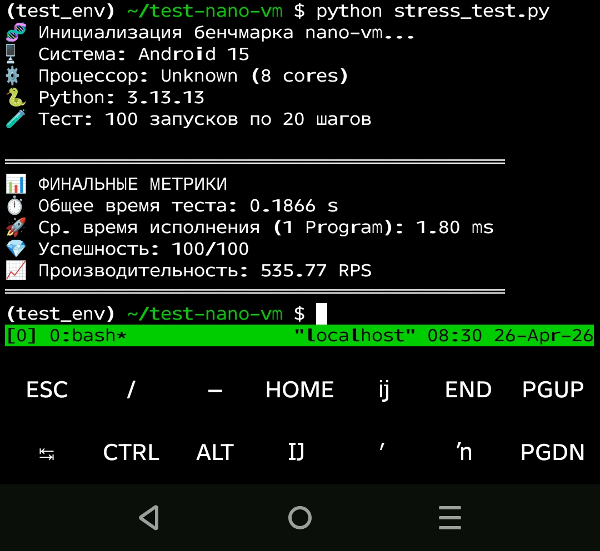

<p align="center">
  <a href="https://github.com/Ale007XD/nano_vm/actions">
    
  </a>
  <a href="https://pypi.org/project/nano-vm/">
    
  </a>
  
  
</p>

<p align="center">
  🧠 <strong>Deterministic VM for LLM program execution.</strong><br>
  Turn unpredictable LLM behavior into structured, reproducible workflows.
</p>

---

## 🧠 Mental Model

- LLM → stateless worker
- Program → declarative workflow (DSL)
- ExecutionVM → deterministic state machine
- Trace → full execution log

> «nano-vm is a finite state machine (FSM) for LLM workflows.»

---

## ⚠️ The Problem

LLM agents are unpredictable:

- decide next steps dynamically
- may skip critical checks
- behavior varies between runs

---

## ✅ The Solution

```
user_input → Planner (1 LLM call, optional)
           → Program (DSL)
           → ExecutionVM (deterministic)
           → Trace
```

- **Planner** = flexible, non-deterministic
- **VM** = strict, deterministic

---

## 🚀 Install

```bash
pip install nano-vm
pip install nano-vm[litellm]
```

---

## ⚡ Quick Example (Deterministic Guardrail)

```python
program = Program.from_dict({
    "name": "customer_refund",
    "steps": [
        {
            "id": "analyze",
            "type": "llm",
            "prompt": "Is this a valid refund request?\nRequest: $user_input",
            "output_key": "decision",
        },
        {
            "id": "guardrail",
            "type": "condition",
            "condition": "'yes' in '$decision'.lower()",
            "then": "process_refund",
            "otherwise": "reject",
        },
    ],
})
```

👉 **Guarantees:**

- `guardrail` **ALWAYS** runs
- no skipped steps
- deterministic execution path

---

## ⚡ Performance

`nano-vm` is designed for high-throughput AI agent ecosystems. By leveraging **Pydantic v2** and an immutable state architecture, the core execution engine introduces near-zero overhead.

### Benchmark Results (Android 15 / Termux)

The following results were achieved on a mobile device (8 cores) running Python 3.13.13 inside Termux:

| Metric | Value |
| :--- | :--- |
| **Throughput (RPS)** | **~535 programs/sec** |
| **Avg. Latency** | **1.80 ms** per program |
| **Complexity** | 20 steps (Mix of Tools & Conditions) |

**Proof (Terminal Output):**



> [!TIP]
> This means you can run hundreds of deterministic agent sessions concurrently on a single CPU core without noticing any lag from the VM itself.

To run benchmarks on your own hardware:

```bash
python benchmarks/stress_test.py
```

---

## 🤖 Planner (Optional)

```python
program = await planner.generate("Find latest AI news and summarize")
```

- exactly 1 LLM call
- outputs DSL program
- not deterministic

---

## 📜 Program DSL

```json
{
  "id": "step_1",
  "type": "llm | tool | condition"
}
```

### Variables

| Syntax | Meaning |
| :--- | :--- |
| `$key` | input context |
| `$step_id.output` | previous step result |

---

## 🔍 Observability (Trace)

```python
trace = await vm.run(program)

trace.status          # SUCCESS / FAILED
trace.final_output    # last step output
trace.total_tokens()  # across all steps
trace.total_cost_usd() # cost in USD
```

Each step includes: duration · tokens · cost · status

👉 Full debugging without guesswork.

---

## ⚖️ nano-vm vs Agents

| | LLM Agent | nano-vm |
| :--- | :--- | :--- |
| Control | LLM decides | You define |
| Determinism | ❌ | ✅ |
| Debugging | hard | full trace |
| Guardrails | weak | enforced |

---

## ❌ When NOT to use nano-vm

**Do NOT use if:**

- workflow is unknown
- task is creative / open-ended
- you need autonomous reasoning

**Use it when:**

- flow is known
- correctness matters
- reproducibility is required

---

## 🔌 Custom Adapter

```python
class MyAdapter:
    async def complete(self, messages, **kwargs) -> str:
        return "response"
```

---

## 📡 Providers (LiteLLM)

```python
LiteLLMAdapter("groq/llama-3.3-70b-versatile")
LiteLLMAdapter("openrouter/llama-3.3-70b-instruct:free")
LiteLLMAdapter("ollama/llama3")
```

---

## 💼 nano-vm Pro

nano-vm follows an open-core model:

- 🆓 **Core** (this repo) — MIT, fully open-source
- 💼 **Pro layer** — commercial extensions

Planned Pro features:

- 📊 Advanced Trace UI (visual execution graph)
- 🌐 Distributed execution (multi-node VM)
- 🔄 Provider pools & smart routing
- 🔐 Access control & multi-user support
- 📈 Observability (metrics, logs, cost analytics)

If you're interested in early access or enterprise use — reach out.

---

## 🤝 Contact & Support

**Author:** [@ale007xd](https://t.me/ale007xd) on Telegram · [@ale007xd](https://x.com/ale007xd) on X

### ☕ Support the project

[](https://www.buymeacoffee.com/ale007xd)
[-2ea2cc?style=flat-square&logo=ton)](https://tonviewer.com/UQCakyytrEGBikOi3eYMpveGHXDB1-fd6lcuQC9VvKqMrI-9)

**Direct wallet — USDT (TON):**
```
UQCakyytrEGBikOi3eYMpveGHXDB1-fd6lcuQC9VvKqMrI-9
```

---

## 📄 License

This project is licensed under the [MIT License](LICENCE).
